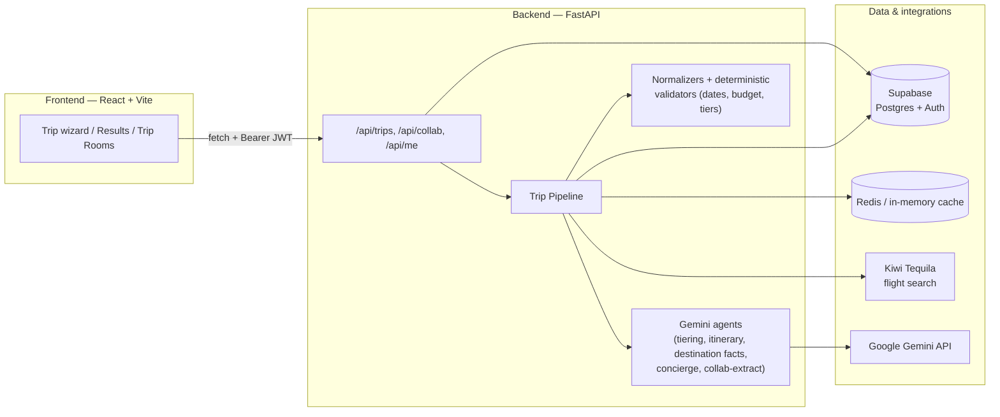

# TripTiers (Trip-Ease)

**One trip request, three real ways to take it — solo or planned live with friends in a group chat.**

TripTiers turns "we should go to Bali" into three fully-priced, day-by-day itineraries (Backpacker / Comfort / Luxury) built from real flight prices, cost-aware hotel estimates, and AI-generated day plans grounded in curated destination facts. Groups can plan together in a shared **Trip Room** chat, where a command-driven AI assistant (`/assistant ...`) fills in a shared trip brief — destination, dates, budget, travelers, style — that anyone can edit, right up until the group generates.

## Demo

- **Demo video:** _[add link here]_
- **Live app:** _[add frontend deploy link here]_
- **Live API:** _[add backend deploy link here]_

## Table of contents

- [How it works](#how-it-works)
- [Key features](#key-features)
- [Architecture](#architecture)
- [Tech stack](#tech-stack)
- [Repository structure](#repository-structure)
- [Backend deep dive](#backend-deep-dive)
- [Frontend deep dive](#frontend-deep-dive)
- [Getting started](#getting-started)
- [Environment variables](#environment-variables)
- [Testing](#testing)
- [Deployment](#deployment)

## How it works

1. **Solo mode:** a user fills a 3-step wizard (destination/dates → budget/travelers → review). The backend runs a pipeline that fetches a real cheapest flight, estimates hotel cost per tier, asks Gemini to sanity-check pricing/highlights, and generates a day-by-day itinerary per tier — all three tiers are built from the *same* flight and destination facts so they're a fair, apples-to-apples comparison.
2. **Group mode:** a user creates a **Trip Room** and invites friends by code/link. Everyone chats freely; anyone can type `/assistant <instruction>` (e.g. `/assistant 4 day trip to Thailand from Delhi, budget 2000`) and the assistant extracts structured fields (destination, dates, budget, travelers, tier, pace, dietary) into a shared **trip brief** shown in the room sidebar. Any member can update any field at any time — last write wins. Once the brief is complete, the group generates a trip together and it's saved to the room.

## Key features

- **Three-tier trip generation** — Backpacker, Comfort, and Luxury itineraries built from one real flight search + destination facts, so the tiers are genuinely comparable (see [`ItineraryDayCard`](frontend/src/components/results/ItineraryDayCard.tsx), [`TierCard`](frontend/src/components/results/TierCard.tsx)).
- **Real flight pricing** via the Kiwi Tequila API (with a `KIWI_MOCK` fallback for local dev without partner API access), cached in Redis/in-memory and durably in Postgres so repeat searches and API outages don't block generation.
- **AI itinerary + tiering + destination-facts agents** powered by Google Gemini, using Pydantic-schema structured output so every LLM call returns validated, typed data instead of free-form text.
- **Group trip rooms** with realtime-ish chat (short-poll), a command-driven assistant (`/assistant ...`), inline multiple-choice questions for ambiguous fields (e.g. "what trip styles are available?"), and a shared, always-editable trip brief.
- **Deterministic input normalization** for messy chat input — dates ("three august 2026", "21 aug 2026", "next friday"), budgets ("20k", "₹20,000", "twenty thousand"), traveler counts ("solo", "a couple", "five of us"), and tier/pace synonyms all normalize to strict typed values before hitting the pipeline.
- **Auth + persistence via Supabase** — email/password and Google OAuth, saved trips per user, and Postgres-backed collaboration rooms with row-level durability for messages, members, and the trip brief.
- **MCP (Model Context Protocol) server** exposing the same flight-search, destination-facts, hotel-cost, and budget-normalization tools to any MCP-compatible client (e.g. Claude Desktop, Cursor) — the FastAPI pipeline also calls these underlying functions directly for speed.
- **Deterministic quality gates** — after generation, `validate_trip_result` checks itineraries aren't empty, tiers aren't missing, and prices aren't below the flight cost alone; a failed check retries once before surfacing an error instead of silently returning a broken trip.

## Architecture



The trip pipeline (`backend/app/orchestrator/trip_pipeline.py`) is the heart of the backend:

1. Resolve destination facts (cached, bootstrapped from Gemini + curated data on first lookup).
2. Search the cheapest real flight for the route/dates (Kiwi, cached).
3. Estimate a hotel price-per-night for each of the three tiers from the destination's cost index.
4. Ask the **tiering agent** (Gemini) to sanity-check pricing, pick stay names, and flag a budget warning if the budget can't cover the flight.
5. Run the **itinerary agent** for all three tiers in parallel to produce a day-by-day plan grounded in curated destination facts (never inventing attraction names).
6. Convert prices to the destination's local currency via live FX rates when needed.
7. Run deterministic validation on the assembled result; retry itinerary generation once for any tier that fails before raising an error.
8. Persist the trip to Supabase and return it.

## Tech stack

| Layer | Technology |
|---|---|
| Frontend | React 19, Vite 8, TypeScript, React Router 7, Zustand, Tailwind CSS v4, shadcn/ui (Base UI primitives), Framer Motion, React Hook Form + Zod |
| Backend | Python 3.11+, FastAPI, Pydantic v2 / Pydantic Settings, `uv` for dependency management, `structlog` for logging, `tenacity` for retries |
| AI | Google Gemini (`google-genai`) via structured JSON-schema output; a FastMCP server exposing the same tools over MCP |
| Data | Supabase (Postgres + Auth), Redis (Upstash-compatible) with an in-memory + Postgres durable fallback |
| External APIs | Kiwi Tequila (flight search), FX rate service (currency conversion) |
| Deploy targets | Render / Fly.io / Railway / Cloud Run (backend, Docker), Vercel / Netlify (frontend, static) |

## Repository structure

```
TripEase/
├── backend/
│   ├── app/
│   │   ├── agents/          # Gemini-backed agents: tiering, itinerary, destination facts, concierge, collab-extract, flight search
│   │   ├── auth/            # Supabase JWT verification (CurrentUserDep)
│   │   ├── db/               # Repositories (trips, collab, destinations, flight cache) + collab_schema.sql + seed data
│   │   ├── mcp_server/       # FastMCP server + underlying tool implementations (search_flights, get_destination_facts, estimate_hotel_cost, normalize_budget)
│   │   ├── orchestrator/     # trip_pipeline.py — the end-to-end trip generation flow
│   │   ├── prompts/          # System prompts (*.prompt.md) for each agent
│   │   ├── routers/          # FastAPI routes: /api/trips, /api/collab, /api/me, /health
│   │   ├── services/         # Gemini client, cache, Kiwi client, FX client, trip-brief field parsing, concierge command handling
│   │   ├── utils/            # dates, number-word parsing, slugs, logging, retry, errors
│   │   └── validators/       # Pydantic schemas + deterministic date/budget normalizers + trip result validator
│   ├── tests/                 # pytest suite (date/budget normalizers, trip-brief fields, pipeline)
│   └── Dockerfile
├── frontend/
│   ├── src/
│   │   ├── components/        # ui/ (shadcn primitives), trip-search/, results/, layout/, auth/
│   │   ├── pages/             # One file per route, incl. dashboard/ (rooms, invite, profile, trips)
│   │   ├── store/             # Zustand stores: auth, trip search, collab rooms
│   │   ├── lib/                # API clients, Supabase client, formatting, date helpers
│   │   ├── mocks/              # Fixture trips so the UI runs standalone without a backend
│   │   └── types/              # Shared TypeScript contracts (trip.ts, collab.ts)
│   └── vercel.json / public/_redirects   # SPA rewrite config for Vercel / Netlify
├── DEPLOY.md                  # Step-by-step production deployment checklist
└── FRONTEND_CHATBOT_ITINERARY_SPEC.md   # Product spec for the group-chat trip planning flow
```

## Backend deep dive

**Agents** (`backend/app/agents/`) — each wraps one Gemini call via `create_structured_output`, which enforces a Pydantic JSON schema on the model's response so the rest of the codebase works with typed objects, never raw text:

- `flight_search_agent` — not actually an LLM call; wraps the Kiwi search deterministically and picks the cheapest option.
- `tiering_agent` — given the real flight + hotel estimates, produces per-tier stay names/types, highlights, and a budget warning if needed. Never invents prices.
- `itinerary_agent` — produces a day-by-day plan per tier, grounded in the destination's curated facts (attractions/neighborhoods/tips) so it can't hallucinate places that don't exist. Cached per destination+tier+day-count, with a separate short-TTL cache when group preferences personalize the result.
- `destination_facts_agent` — bootstraps curated facts + a cost index for a destination the first time it's requested; subsequent requests hit the cache/DB.
- `concierge_agent` — powers the Trip Room `/assistant` command: extracts trip-brief fields from a chat instruction, decides whether the user is asking a question that needs a multiple-choice answer (vs. giving an instruction), and resolves relative dates against "today".
- `collab_agent` — extracts a full trip request from an entire room's chat transcript (used by the legacy/no-room-context generate path).

**Orchestrator** (`backend/app/orchestrator/trip_pipeline.py`) ties the above together end-to-end (see [Architecture](#architecture)) and is called from both `/api/trips` (solo) and the collab generate flow (group).

**Deterministic normalization** (`backend/app/validators/`, `backend/app/services/trip_brief_fields.py`) — before any value reaches the pipeline or gets stored in a trip brief, free-text chat input is normalized:

- Dates: `date_normalizer.py` handles ISO, `DD/MM/YYYY`, and natural language ("3 august 2026", "next friday", "sept 5"), including spelled-out day numbers, with sensible year-rollover for partial dates.
- Budget: `budget_normalizer.py` handles `"20k"`, `"₹20,000"`, `"twenty thousand"`, scale words, and currency symbols.
- Travelers/tier/pace: spelled-out numbers and common synonyms ("solo", "a couple", "backpacking" → `backpacker`) are mapped to canonical values.

**Collaboration** (`backend/app/routers/collab.py`, `backend/app/services/concierge_debouncer.py`) — rooms are silent by default; the assistant only acts when a member types `/assistant <instruction>`, extracting and posting confirmations for whatever it resolved, or a small inline multiple-choice question (`kind: "choice"`) when the member asked about available options for a field. Any member can update any already-resolved field — the room always reflects the latest tap/command, not just the first.

**MCP server** (`backend/app/mcp_server/travel_tools_server.py`) exposes `search_flights_tool`, `get_destination_facts_tool`, `estimate_hotel_cost_tool`, and `normalize_budget_tool` over the Model Context Protocol, so the same deterministic/grounded tools the pipeline uses internally can be plugged into any MCP-compatible AI client.

## Frontend deep dive

- **Routing** (`src/App.tsx`) — public routes (landing, results, join-room, auth callback) under `SiteLayout`; a focused wizard flow (`/plan`, `/plan/generating`) under `FocusLayout`; and an authenticated dashboard (`/dashboard/*` — trips, invite, profile, rooms) gated by `RequireAuth`.
- **State** — Zustand stores for auth (`authStore.ts`, backed by Supabase sessions), the solo trip wizard (`tripStore.ts`), and collaboration rooms (`collabStore.ts`).
- **API client** (`src/lib/api.ts`, `src/lib/collabApi.ts`) — talks to the FastAPI backend when `VITE_API_URL` is set; otherwise falls back to `src/mocks/` fixtures so the UI is fully explorable without any backend running.
- **Mock-first design** — every API function has a mock counterpart shaped identically to the real response, so the frontend was originally (and can still be) developed and demoed with zero backend dependency.

## Getting started

Requires **Python 3.11+** with [`uv`](https://docs.astral.sh/uv/), and **Node.js 20+** with npm.

### 1. Backend

```bash
cd backend
cp .env .env.local   # or create .env — see Environment variables below
uv sync --extra dev
uv run python -m app.db.seed        # optional: seed sample destinations
uv run uvicorn app.main:app --reload --port 3001
```

Verify it's up: `curl http://localhost:3001/health` → `{"status":"ok"}`.

### 2. Frontend

```bash
cd frontend
npm install
npm run dev
```

Open the URL Vite prints (defaults to **http://localhost:5173**). Leave `VITE_API_URL` unset to run against mock data only, or point it at `http://localhost:3001` to use the real backend.

### 3. Supabase schema

Run `backend/app/db/collab_schema.sql` in your Supabase project's SQL editor to create the `profiles`, `collab_rooms`, `collab_members`, and `collab_messages` tables (safe to re-run).

## Environment variables

### Backend (`backend/.env`)

| Variable | Required | Notes |
|---|---|---|
| `ENVIRONMENT` | No (default `development`) | `production` requires `REDIS_URL` and either `KIWI_MOCK=true` or `KIWI_API_KEY` |
| `PORT` | No (default `3001`) | |
| `CORS_ORIGIN` | Yes | Comma-separated list of allowed frontend origins |
| `APP_CURRENCY` | No (default `USD`) | `USD` or `INR` |
| `SUPABASE_URL` | Yes | |
| `SUPABASE_SERVICE_ROLE_KEY` | Yes | Server-side key, never expose to the frontend |
| `SUPABASE_ANON_KEY` | No | Needed for verifying frontend-issued JWTs |
| `GEMINI_API_KEY` | Yes | Free key from [aistudio.google.com/apikey](https://aistudio.google.com/apikey) |
| `GEMINI_MODEL` | No (default `gemini-flash-lite-latest`) | Use a `-lite` model for a higher free-tier quota |
| `KIWI_API_KEY` | No | Kiwi Tequila is partner-only; leave unset with `KIWI_MOCK=true` for local dev |
| `KIWI_MOCK` | No (default `false`) | Set `true` to skip live Kiwi calls |
| `REDIS_URL` | Required in production | Falls back to in-memory cache if omitted in dev |

### Frontend (`frontend/.env`)

| Variable | Required | Notes |
|---|---|---|
| `VITE_API_URL` | No | Backend base URL. Omit to run entirely on mock data |
| `VITE_SUPABASE_URL` | Yes (for auth) | |
| `VITE_SUPABASE_ANON_KEY` | Yes (for auth) | |

## Testing

```bash
cd backend
uv run pytest
```

Covers date normalization, budget normalization, trip-brief field parsing, and the trip pipeline.

## Deployment

See [`DEPLOY.md`](DEPLOY.md) for a full checklist covering Supabase, Gemini, Redis, backend hosting (Render/Fly.io/Railway/Cloud Run), frontend hosting (Vercel/Netlify), CORS wiring, and smoke testing.
