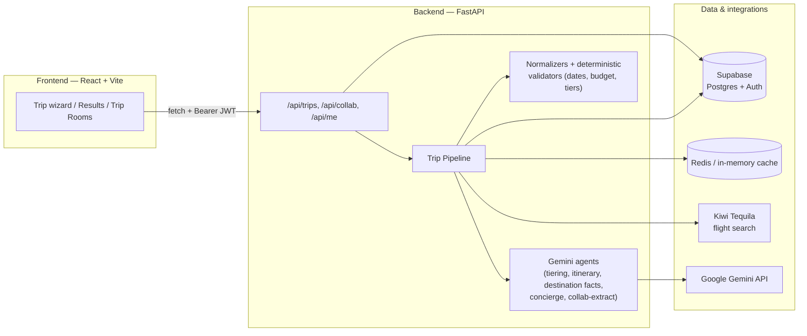

# TripTiers (Trip-Ease)

**One trip request, three real ways to take it — solo or planned live with friends in a group chat.**

TripTiers turns "we should go to Bali" into three fully-priced, day-by-day itineraries (Backpacker / Comfort / Luxury) built from real flight prices, cost-aware hotel estimates, and AI-generated day plans grounded in curated destination facts. Groups can plan together in a shared **Trip Room** chat, where a command-driven AI assistant (`/assistant ...`) fills in a shared trip brief — destination, dates, budget, travelers, style — that anyone can edit, right up until the group generates.

## Demo

- **Demo video:** _[add link here]_
- **Live app:** _[add frontend deploy link here]_
- **Live API:** _[add backend deploy link here]_

## Table of contents

- [How it works](#how-it-works)
- [Key features](#key-features)
- [Architecture](#architecture)
- [Tech stack](#tech-stack)
- [Repository structure](#repository-structure)
- [Backend deep dive](#backend-deep-dive)
- [Frontend deep dive](#frontend-deep-dive)
- [Getting started](#getting-started)
- [Environment variables](#environment-variables)
- [Testing](#testing)
- [Deployment](#deployment)

## How it works

1. **Solo mode:** a user fills a 3-step wizard (destination/dates → budget/travelers → review). The backend runs a pipeline that fetches a real cheapest flight, estimates hotel cost per tier, asks Gemini to sanity-check pricing/highlights, and generates a day-by-day itinerary per tier — all three tiers are built from the *same* flight and destination facts so they're a fair, apples-to-apples comparison.
2. **Group mode:** a user creates a **Trip Room** and invites friends by code/link. Everyone chats freely; anyone can type `/assistant <instruction>` (e.g. `/assistant 4 day trip to Thailand from Delhi, budget 2000`) and the assistant extracts structured fields (destination, dates, budget, travelers, tier, pace, dietary) into a shared **trip brief** shown in the room sidebar. Any member can update any field at any time — last write wins. Once the brief is complete, the group generates a trip together and it's saved to the room.

## Key features

- **Three-tier trip generation** — Backpacker, Comfort, and Luxury itineraries built from one real flight search + destination facts, so the tiers are genuinely comparable (see [`ItineraryDayCard`](frontend/src/components/results/ItineraryDayCard.tsx), [`TierCard`](frontend/src/components/results/TierCard.tsx)).
- **Real flight pricing** via the Kiwi Tequila API (with a `KIWI_MOCK` fallback for local dev without partner API access), cached in Redis/in-memory and durably in Postgres so repeat searches and API outages don't block generation.
- **AI itinerary + tiering + destination-facts agents** powered by Google Gemini, using Pydantic-schema structured output so every LLM call returns validated, typed data instead of free-form text.
- **Group trip rooms** with realtime-ish chat (short-poll), a command-driven assistant (`/assistant ...`), inline multiple-choice questions for ambiguous fields (e.g. "what trip styles are available?"), and a shared, always-editable trip brief.
- **Deterministic input normalization** for messy chat input — dates ("three august 2026", "21 aug 2026", "next friday"), budgets ("20k", "₹20,000", "twenty thousand"), traveler counts ("solo", "a couple", "five of us"), and tier/pace synonyms all normalize to strict typed values before hitting the pipeline.
- **Auth + persistence via Supabase** — email/password and Google OAuth, saved trips per user, and Postgres-backed collaboration rooms with row-level durability for messages, members, and the trip brief.
- **MCP (Model Context Protocol) server** exposing the same flight-search, destination-facts, hotel-cost, and budget-normalization tools to any MCP-compatible client (e.g. Claude Desktop, Cursor) — the FastAPI pipeline also calls these underlying functions directly for speed.
- **Deterministic quality gates** — after generation, `validate_trip_result` checks itineraries aren't empty, tiers aren't missing, and prices aren't below the flight cost alone; a failed check retries once before surfacing an error instead of silently returning a broken trip.

## Architecture



The trip pipeline (`backend/app/orchestrator/trip_pipeline.py`) is the heart of the backend:

1. Resolve destination facts (cached, bootstrapped from Gemini + curated data on first lookup).
2. Search the cheapest real flight for the route/dates (Kiwi, cached).
3. Estimate a hotel price-per-night for each of the three tiers from the destination's cost index.
4. Ask the **tiering agent** (Gemini) to sanity-check pricing, pick stay names, and flag a budget warning if the budget can't cover the flight.
5. Run the **itinerary agent** for all three tiers in parallel to produce a day-by-day plan grounded in curated destination facts (never inventing attraction names).
6. Convert prices to the destination's local currency via live FX rates when needed.
7. Run deterministic validation on the assembled result; retry itinerary generation once for any tier that fails before raising an error.
8. Persist the trip to Supabase and return it.

## Tech stack

| Layer | Technology |
|---|---|
| Frontend | React 19, Vite 8, TypeScript, React Router 7, Zustand, Tailwind CSS v4, shadcn/ui (Base UI primitives), Framer Motion, React Hook Form + Zod |
| Backend | Python 3.11+, FastAPI, Pydantic v2 / Pydantic Settings, `uv` for dependency management, `structlog` for logging, `tenacity` for retries |
| AI | Google Gemini (`google-genai`) via structured JSON-schema output; a FastMCP server exposing the same tools over MCP |
| Data | Supabase (Postgres + Auth), Redis (Upstash-compatible) with an in-memory + Postgres durable fallback |
| External APIs | Kiwi Tequila (flight search), FX rate service (currency conversion) |
| Deploy targets | Render / Fly.io / Railway / Cloud Run (backend, Docker), Vercel / Netlify (frontend, static) |


### 1. Backend

```bash
cd backend
cp .env .env.local   # or create .env — see Environment variables below
uv sync --extra dev
uv run python -m app.db.seed        # optional: seed sample destinations
uv run uvicorn app.main:app --reload --port 3001
```

Verify it's up: `curl http://localhost:3001/health` → `{"status":"ok"}`.

### 2. Frontend

```bash
cd frontend
npm install
npm run dev
```

Open the URL Vite prints (defaults to **http://localhost:5173**). Leave `VITE_API_URL` unset to run against mock data only, or point it at `http://localhost:3001` to use the real backend.

### 3. Supabase schema

Run `backend/app/db/collab_schema.sql` in your Supabase project's SQL editor to create the `profiles`, `collab_rooms`, `collab_members`, and `collab_messages` tables (safe to re-run).


## Testing

```bash
cd backend
uv run pytest
```

Covers date normalization, budget normalization, trip-brief field parsing, and the trip pipeline.

